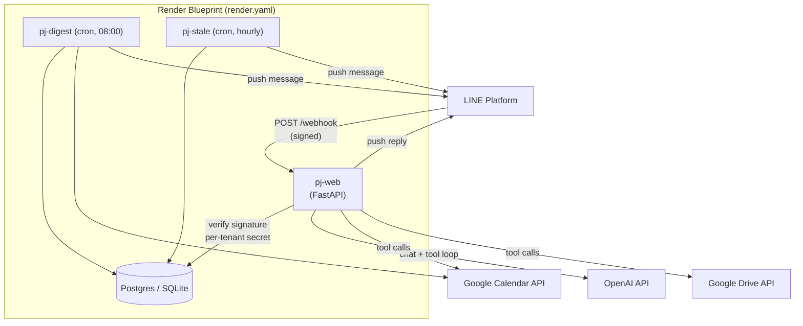
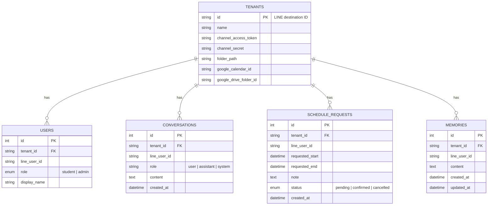

# pj — Multi-Tenant SAT Math Assistant for LINE

A production-ready, multi-tenant LINE Messaging API backend that runs
**pj**, an AI SAT Math tutor assistant with role-aware tool calling
(Google Calendar + Drive) and 24/7 background scheduling.


One backend serves any number of independent LINE Official Accounts
("tenants") — each with its own tutor, calendar, Drive folder, and set of
students — with isolated chat history, role-based permissions (student vs
admin), and no cross-tenant data leakage.

## Table of contents

- [Overview](#overview)
- [Architecture](#architecture)
- [Tech stack](#tech-stack)
- [Quick start](#quick-start)
- [Configuration](#configuration)
- [Database schema](#database-schema)
- [Long-term memory](#long-term-memory)
- [Tools & role-based permissions](#tools--role-based-permissions)
- [Background jobs](#background-jobs)
- [Deployment](#deployment)
- [Testing](#testing)
- [Troubleshooting](#troubleshooting)
- [Project structure](#project-structure)
- [Known limitations / roadmap](#known-limitations--roadmap)

## Overview

A student or tutor messages pj on LINE like any other contact. Behind that
one chat interface:

- **Multi-tenant by design** — the LINE `destination` ID in every webhook
  payload routes the request to the right tenant's own LINE credentials,
  Google Calendar, Drive folder, and conversation history. Tenants never
  see each other's data.
- **Role-aware** — every user is a `student` or `admin`. pj gets a
  different system prompt and a different, enforced set of tools per
  role (e.g. only admins can actually book a calendar slot).
- **Tool-calling, not just chat** — pj can check real calendar
  availability, search a real Drive folder, log/confirm session requests,
  and (as an admin) book/cancel events or upload materials — via OpenAI
  function calling dispatched to the Google APIs server-side.
- **Remembers across conversations** — beyond the rolling 10-message chat
  window, pj extracts durable facts (preferences, weak topics, recurring
  scheduling patterns) and carries them into every future conversation
  with that user, even weeks later. See [Long-term memory](#long-term-memory).
- **Runs unattended** — a daily admin digest and an hourly stale-request
  reminder run as scheduled jobs, independent of anyone messaging the bot.
- **Deployable in one apply** — a `render.yaml` Blueprint provisions
  Postgres, the web service, and both cron jobs on Render; the same
  Docker image works on any other container host.

## Architecture



**Request flow:** LINE signs every webhook POST with a per-channel secret.
Because this service is multi-tenant, the tenant (and therefore which
secret to verify against) is only known once the JSON body is parsed — so
`destination` is read *before* signature verification, the matching
tenant row is looked up, and only then is the signature checked against
that tenant's own `channel_secret`. See `app/main.py`.

## Tech stack

| Layer | Choice |
|---|---|
| Web framework | FastAPI (async) on Gunicorn + Uvicorn workers |
| LINE SDK | `line-bot-sdk` v3 (async `MessagingApi`, `WebhookParser`) |
| ORM / DB | SQLModel (SQLAlchemy 2.0 async) — SQLite locally, Postgres in production |
| LLM | OpenAI (`AsyncOpenAI`, function/tool calling, multi-turn loop) |
| External tools | `google-api-python-client` (Calendar + Drive), service-account auth |
| Scheduling | APScheduler (always-on) or platform-native cron (`run_job.py`) |
| Hosting | Docker image; `render.yaml` Blueprint for Render, `Procfile` for Railway/Heroku-style |

## Quick start

```bash
git clone <this-repo> && cd Satmath67
python3 -m venv .venv && source .venv/bin/activate
pip install -r requirements.txt

cp .env.example .env        # fill in OPENAI_API_KEY at minimum
python seed.py init-db

# register your first tenant (see "Configuration" for where each value comes from)
python seed.py add-tenant \
  --id <line-destination-id> --name "My Tutoring Group" \
  --channel-secret <...> --channel-access-token <...>

uvicorn app.main:app --reload --port 8000
```

In another terminal, tunnel it and point LINE at it:

```bash
ngrok http 8000
# LINE Developers Console -> your channel -> Messaging API -> Webhook settings
#   Webhook URL: https://<ngrok-id>.ngrok-free.app/webhook -> Verify -> Use webhook: ON
```

Message the bot. You should get a reply, and see structured logs like:

```
INFO:pj.webhook:Received message: tenant=U... user=U... role=student text='...'
```

Google Calendar/Drive tool calls need one more piece of setup — see
[Configuration](#configuration).

## Configuration

All configuration is environment variables (`app/config.py`), loaded from
`.env` locally. `.env.example` has every key with inline comments.

| Variable | Required | Purpose |
|---|---|---|
| `DATABASE_URL` | no (defaults to local SQLite) | `sqlite+aiosqlite:///./pj.db` locally; a Postgres URL in production. `postgres://`/`postgresql://` URLs from Render/Supabase/Neon are auto-rewritten to `postgresql+asyncpg://` — paste them in as-is. |
| `OPENAI_API_KEY` | **yes** | pj's LLM. From [platform.openai.com](https://platform.openai.com/api-keys). |
| `OPENAI_MODEL` | no (default `gpt-5.4-nano`) | Any tool-calling-capable chat model with JSON/structured output support (used for both chat and memory extraction). Nano was picked for cost/speed since scheduling is the priority use case, not deep math reasoning — bump to a stronger model if tutoring-answer quality matters more for your deployment. |
| `GOOGLE_SERVICE_ACCOUNT_FILE` **or** `GOOGLE_SERVICE_ACCOUNT_JSON` | only if using Calendar/Drive tools | Set exactly one. File path locally; full key JSON as a single-line string in production (no persistent disk to put a file on). See below. |
| `LINE_CHANNEL_SECRET` / `LINE_CHANNEL_ACCESS_TOKEN` | no | Convenience defaults for `seed.py add-tenant --from-env` only. Runtime webhook handling always reads per-tenant values from the `tenants` table — never these. |
| `DIGEST_TIMEZONE` | no (default `UTC`) | IANA tz (e.g. `Asia/Bangkok`) the daily digest's "today" is computed in. |
| `STALE_REQUEST_HOURS` | no (default `24`) | How long a session request can sit unconfirmed before the reminder job flags it. |
| `ENABLE_SCHEDULER` | no (default `false`) | Runs the in-process APScheduler inside the web process. Only safe on a single, unscaled instance — see [Background jobs](#background-jobs). No effect on Vercel (no persistent process to run it in). |
| `CRON_SECRET` | only on Vercel | Protects the `/internal/cron/*` routes Vercel Cron Jobs call. Vercel auto-sends it back as `Authorization: Bearer <CRON_SECRET>` — see [Deployment](#deployment). |

<details>
<summary><strong>Setting up the Google service account</strong> (needed for Calendar/Drive tools)</summary>

pj authenticates to Google as one shared **service account** — not
per-user OAuth, since it acts on the tutor's own calendar and shared
materials folder.

1. In [Google Cloud Console](https://console.cloud.google.com/), enable
   the **Google Calendar API** and **Google Drive API** for a project.
2. Create a service account (IAM & Admin → Service Accounts) and
   download a JSON key.
3. Locally: save it (e.g. `secrets/google-service-account.json`, already
   `.gitignore`d) and set `GOOGLE_SERVICE_ACCOUNT_FILE` to that path. In
   production: paste the whole key JSON into `GOOGLE_SERVICE_ACCOUNT_JSON`.
4. Copy the service account's `client_email`
   (`pj-bot@your-project.iam.gserviceaccount.com`-shaped).
5. **Per tenant**, share that tutor's Google Calendar and Drive materials
   folder with that email:
   - Calendar → Settings → that calendar → "Share with specific people" →
     add the email with **"Make changes to events"**.
   - Drive folder → Share → add the email as **Editor**.
6. Get the two IDs for `seed.py add-tenant`: the Calendar ID is usually
   the tutor's Gmail address (or Settings → "Integrate calendar" →
   Calendar ID); the Drive folder ID is the segment after `/folders/` in
   the folder's URL.

</details>

## Database schema



- **conversations** is scoped to `(tenant_id, line_user_id)`, giving every
  student their own isolated thread even within the same tenant — but only
  the *last 10* rows per user are ever fed back to the LLM. This is
  short-term/working memory, not long-term.
- **schedule_requests** exists because students can't book the calendar
  directly: `request_session_time` logs a pending row here; an admin
  resolves it via `resolve_schedule_request`. It's also what the
  stale-reminder job scans.
- **memories** is long-term memory — durable facts extracted from
  conversation, independent of the 10-message window, injected into every
  future system prompt for that user. See [Long-term memory](#long-term-memory).

No Alembic migration chain yet — `init_db()` (run on every process start)
creates missing tables via `SQLModel.metadata.create_all` and separately
`ALTER TABLE`s in the `google_calendar_id`/`google_drive_folder_id`
columns on a pre-existing `tenants` table. Safe to run repeatedly, on
SQLite or Postgres. Worth replacing with real migrations before the
schema churns much more.

## Long-term memory

The 10-message rolling window in `conversations` (Phase 2) is *working*
memory — it forgets everything past the last 10 messages, so pj had no way
to recall something a student mentioned last week. This adds real
long-term memory: durable facts survive indefinitely and get pulled into
every future conversation with that user, regardless of how long ago they
were learned.

**What it's based on:** [mem0](https://github.com/mem0ai/mem0)
(`mem0ai/mem0`), the most widely-adopted open-source memory layer for AI
agents (~48k GitHub stars, Apache 2.0). Its core pipeline — extract
candidate facts from a conversation turn, reconcile them against what's
already stored via an LLM call that decides **ADD / UPDATE / DELETE /
NOOP** per fact, then persist and later re-inject the result — is exactly
what's implemented in `app/memory.py`.

**Why it's not a dependency on the `mem0ai` package:** its default local
backend persists to an embedded Qdrant store at `/tmp/qdrant`. `/tmp` (and
most container filesystems generally) is wiped on every redeploy/restart
on Render and similar platforms — long-term memory would silently vanish
on every deploy, which defeats the point. Running Qdrant properly would
mean standing up a second stateful service just for this. We already have
a Postgres database that *is* persisted correctly in production, and each
user realistically accumulates a few dozen memory rows at most — nowhere
near the scale where vector similarity search earns its complexity over
"fetch every row for this user." So `app/memory.py` reimplements mem0's
extract/reconcile/store/inject pattern as plain rows in our existing DB:
zero new infrastructure, correctly durable by construction.

**How it fires**, once per incoming message (`app/llm.py`):

1. Before calling OpenAI, fetch all `memories` rows for `(tenant_id,
   line_user_id)` and append them to the role's system prompt as "What
   you remember about this user from past conversations."
2. After pj's final reply is generated, send the latest exchange plus the
   current memory list (with ids) to a small dedicated LLM call
   (`app/memory.py::extract_and_update_memories`), which returns JSON
   operations (`ADD`/`UPDATE`/`DELETE`/`NOOP`) and applies them.

This is best-effort and fails silently (logged, not raised) if the
extraction call errors — a memory-extraction hiccup should never break
the actual reply to the user.

**Debugging:** `python seed.py show-memories --tenant-id <...>
--line-user-id <...>` prints everything currently stored for that user.

## Tools & role-based permissions

pj's LLM loop (`app/llm.py`) is offered a different tool set per role;
`app/tool_registry.py` enforces that twice — once by only *listing*
permitted tools to the model, and again by rejecting execution
server-side if a disallowed tool is ever requested. `calendar_id`/
`folder_id` are always injected from the tenant's own row, never accepted
as model-supplied arguments, so a tenant's tools can't be pointed at
another tenant's calendar or Drive.

| Tool | Student | Admin | Backing |
|---|:---:|:---:|---|
| `check_teacher_availability` | ✅ read-only | ✅ | Calendar `freebusy.query` |
| `search_student_materials` | ✅ read-only | ✅ | Drive `files.list` |
| `request_session_time` | ✅ | — | DB insert, `status=pending` |
| `update_calendar_slot` (book/cancel) | ❌ | ✅ | Calendar `events.insert` / `.delete` |
| `upload_material` | ❌ | ✅ | Drive `files.create` |
| `get_student_summary` | ❌ | ✅ | DB roster query |
| `list_pending_requests` | ❌ | ✅ | DB query |
| `resolve_schedule_request` | ❌ | ✅ | DB update → `confirmed`/`cancelled` |

## Background jobs

Two jobs (`app/scheduler.py`), each runnable two ways:

- **`send_daily_digest`** — 08:00 (`DIGEST_TIMEZONE`): for each tenant
  with a `google_calendar_id`, lists that day's events and LINE-pushes a
  summary to every `admin` on that tenant.
- **`check_stale_requests`** — hourly: pushes admins a nudge listing
  `schedule_requests` still `pending` past `STALE_REQUEST_HOURS`.

| Mode | Entry point | When to use |
|---|---|---|
| One-shot | `python run_job.py daily-digest`  \| `stale-reminder` | Driven by a platform-native scheduler (Render Cron Jobs, GitHub Actions, an external cron webhook). No always-on process; scaling the web service can't cause duplicate firing. **Used by `render.yaml`.** |
| Always-on | `python worker.py` | Platforms without native cron (Railway, Fly.io, a VPS). Runs APScheduler in a loop. **Run exactly one instance** — two copies double-sends every push. |

`ENABLE_SCHEDULER=true` embeds the always-on mode directly in the web
process instead of a separate `worker.py` — only safe on a single,
unscaled web instance.

## Deployment

<details>
<summary><strong>Render (paid — one Blueprint apply, includes managed Postgres + Cron Jobs)</strong></summary>

`render.yaml` provisions a managed Postgres database, the `pj-web`
service (Docker, `healthCheckPath: /health`), and two native Cron Jobs
(`pj-digest`, `pj-stale`) that run `run_job.py` on schedule.

1. **Connect the repo.** Push to your own GitHub/GitLab remote, then in
   the Render dashboard: **New → Blueprint**, select the repo. Render
   parses `render.yaml` and previews the resources above. Click **Apply**.
2. **Fill in secrets.** `render.yaml` marks these `sync: false` (Render
   creates the slot, you fill the value in via the dashboard, never
   committed to the repo):

   | Variable | Set on |
   |---|---|
   | `OPENAI_API_KEY` | `pj-web` |
   | `GOOGLE_SERVICE_ACCOUNT_JSON` | `pj-web`, `pj-digest`, `pj-stale` |
   | `LINE_CHANNEL_SECRET` / `LINE_CHANNEL_ACCESS_TOKEN` | optional, only if running `seed.py --from-env` against prod from your machine |

   `DATABASE_URL` is wired automatically (`fromDatabase: pj-postgres`).
   The cron schedules in `render.yaml` (`0 8 * * *`, `0 * * * *`) are UTC
   — convert your desired local trigger time to UTC when editing them.
3. **Seed a tenant against production:**
   ```bash
   DATABASE_URL="<render external connection string>" python seed.py add-tenant \
     --id <line-destination-id> --name "My Tutoring Group" \
     --channel-secret <...> --channel-access-token <...> \
     --google-calendar-id teacher@gmail.com --google-drive-folder-id <...>

   DATABASE_URL="<same>" python seed.py set-admin \
     --tenant-id <line-destination-id> --line-user-id <...>
   ```
4. **Point LINE at it.** LINE Developers Console → channel → Messaging
   API → Webhook settings → URL: `https://<your-app>.onrender.com/webhook`
   → Verify → Use webhook: ON. Repeat steps 3–4 per additional tenant
   (same URL for every tenant; `destination` routes internally).
5. **Monitor it.** Point [UptimeRobot](https://uptimerobot.com) or
   [Better Stack](https://betterstack.com/uptime) at
   `GET /health` (fails 503 on DB outage, not just process death).

**Checklist:**

- [ ] `pj-postgres`, `pj-web`, `pj-digest`, `pj-stale` all deployed/succeeded
- [ ] `OPENAI_API_KEY` set on `pj-web`
- [ ] `GOOGLE_SERVICE_ACCOUNT_JSON` set on all three services that need it
- [ ] Service account shared onto each tenant's calendar + Drive folder
- [ ] `GET https://<app>.onrender.com/health` → `200 {"status":"ok"}`
- [ ] Tenant seeded against production `DATABASE_URL`
- [ ] LINE webhook URL updated, **Verify** succeeds
- [ ] Real LINE message round-trips to a reply
- [ ] `pj-digest` / `pj-stale` show successful runs in Render's Logs tab
- [ ] Uptime monitor live on `/health`
- [ ] `ENABLE_SCHEDULER=false` on `pj-web` (Cron Jobs own scheduling — don't double up)

</details>

<details>
<summary><strong>Railway / any other Docker host</strong></summary>

The same `Dockerfile` runs anywhere. Without native cron:

1. Deploy the image as the `web` service (`Procfile`'s `web:` line, or
   the Dockerfile's default `CMD`).
2. Deploy a **second** service from the same image, start command
   `python worker.py` (`Procfile`'s `worker:` line) — run exactly one
   instance.
3. Point `DATABASE_URL` at that platform's Postgres add-on on both
   services.
4. Same LINE webhook / Google service-account steps as above, using that
   platform's public URL.

</details>

<details open>
<summary><strong>Vercel (recommended free option — pairs with Supabase/Neon + GitHub Actions)</strong></summary>

Vercel's Python runtime auto-detects `app/main.py`'s FastAPI `app` object as
the entrypoint — no `api/` directory or extra wrapper file needed.
`vercel.json` (already in the repo) sets a 60s `maxDuration`. This
deployment model is meaningfully different from Render/Railway, so a few
things work differently here:

- **No persistent process, ever.** Every request runs in a fresh/reused
  serverless invocation. `worker.py` (always-on APScheduler) **cannot run
  on Vercel at all** — there's nothing for it to stay alive in. Leave
  `ENABLE_SCHEDULER=false`; it's a no-op here anyway.
- **Scheduling is via GitHub Actions, not Vercel's own Cron Jobs.**
  Vercel's native cron would be the obvious choice, but its **free Hobby
  plan only allows once-per-day schedules — deployment fails outright**
  if any cron expression runs more often than that, and `stale-reminder`
  needs to run hourly. So `vercel.json` intentionally ships with no
  `crons` array. Instead, use the same
  [`.github/workflows/cron.yml`](../.github/workflows/cron.yml) as the
  Render free-tier path (see below): it calls `GET
  /internal/cron/daily-digest` and `GET /internal/cron/stale-reminder`
  (both defined in `app/main.py`, running the same `app/scheduler.py` job
  functions `run_job.py` uses on Render) on a real schedule, for free, at
  any frequency, regardless of Vercel plan. Both routes require
  `Authorization: Bearer <CRON_SECRET>`, checked in the route itself — set
  `CRON_SECRET` as both a Vercel project env var and a GitHub Actions repo
  secret with the same value.
  *(If you're on Vercel Pro and would rather use Vercel's own Cron Jobs
  instead of GitHub Actions, you can add a `crons` array back to
  `vercel.json` — Pro supports real per-minute schedules.)*
- **SQLite will not work in production.** Vercel Functions have a
  read-only filesystem (only `/tmp` is writable, and it's not shared or
  guaranteed to persist between invocations) — `DATABASE_URL` **must**
  point at a real Postgres instance (Neon or Supabase both have solid free
  tiers — see the `$0/month` section below) from the start. There's no
  "just try it with SQLite first" option the way there is locally.

**Steps:**

1. **Database — [Neon](https://neon.tech) or [Supabase](https://supabase.com):**
   create a project, copy its Postgres connection string for
   `DATABASE_URL`. (Supabase free tier auto-pauses after 7 days with zero
   DB activity — the GitHub Actions cron pings below run real queries
   often enough that this shouldn't ever trigger in practice.)
2. Push the repo to GitHub/GitLab, then in the Vercel dashboard: **Add New
   → Project**, import the repo. Vercel should detect the Python/FastAPI
   framework preset automatically from `requirements.txt`.
3. In Project Settings → Environment Variables, add: `DATABASE_URL` (from
   step 1), `OPENAI_API_KEY`, `GOOGLE_SERVICE_ACCOUNT_JSON`, `CRON_SECRET`
   (any random 16+ character string), and optionally `DIGEST_TIMEZONE` /
   `STALE_REQUEST_HOURS`.
4. Deploy. Vercel shows your production URL
   (`https://<project>.vercel.app`).
5. Seed a tenant against that same `DATABASE_URL` from your machine, same
   as the Render steps above, then point the LINE webhook at
   `https://<project>.vercel.app/webhook`.
6. **Cron — GitHub Actions:** in your repo's Settings → Secrets and
   variables → Actions, add `PJ_APP_URL` = `https://<project>.vercel.app`
   (no trailing slash) and `CRON_SECRET` = the same value from step 3.
   `.github/workflows/cron.yml` is already in the repo and needs no
   changes — it just needs those two secrets pointed at your deployment.

Total recurring cost: **$0** on Vercel Hobby + Neon/Supabase free tier +
GitHub Actions, with no cold-start/sleep concerns at all (unlike the
Render free path, which needs an UptimeRobot keep-alive).

</details>

<details>
<summary><strong>$0/month alternative: Render free tier + Neon/Supabase + GitHub Actions (if you'd rather skip Vercel)</strong></summary>

Every piece below has a genuine, indefinite free tier — no trial period,
no credit card. The trade-off is a cold start of 30-60s after 15 minutes
of no traffic, which the keep-alive step neutralizes in practice.

**Why not just apply `render.yaml` as-is:** its `pj-postgres` database is
Render's own free Postgres, which now **expires after 30 days** and gets
deleted after a 14-day grace period unless you upgrade to paid — not
actually free long-term. And Render's native Cron Jobs have no free tier
at all (from $1/mo). This path swaps both of those out.

1. **Database — [Neon](https://neon.tech) or [Supabase](https://supabase.com),
   either works** (`DATABASE_URL`'s `postgres://`/`postgresql://` scheme is
   normalized the same way regardless of provider — see `app/config.py`):
   - **Neon:** free forever, no pause, no expiry.
   - **Supabase:** free forever, but auto-pauses a project after 7 days
     with *zero database activity* (query/API traffic, not dashboard
     visits). Step 3 below pings `/health`, which runs a real `SELECT 1`
     against the DB every 5 minutes — that resets the pause timer on its
     own, so in practice this never actually pauses. If it ever does
     (e.g. you turn off the uptime monitor for a week), un-pausing is one
     click in the Supabase dashboard, ~30s.

   Either way: create a project, copy its Postgres connection string into
   `DATABASE_URL`.
2. **Web service — Render free tier:** in the Render dashboard, **New →
   Web Service** (not "Blueprint" — you don't want `render.yaml`'s
   database/cron resources here), connect the repo, Docker runtime
   (uses the existing `Dockerfile`), plan **Free**. Set env vars:
   `DATABASE_URL` (your Neon/Supabase string), `OPENAI_API_KEY`,
   `GOOGLE_SERVICE_ACCOUNT_JSON`, `CRON_SECRET` (any random 16+ character
   string), `healthCheckPath` = `/health` under Settings.
3. **Keep it awake — [UptimeRobot](https://uptimerobot.com) free plan:**
   add an HTTPS monitor for `https://<your-app>.onrender.com/health`,
   interval 5 minutes (UptimeRobot's free-plan minimum, comfortably under
   Render's 15-minute sleep threshold). This also gives you real uptime
   alerting for free, and Render's free tier includes 750 instance-hours/
   month — a full month is ~730 hours, so staying warm 24/7 this way
   doesn't run you into the free-hour cap. (Same ping also prevents a
   Supabase pause, per step 1.)
4. **Cron — GitHub Actions** (`.github/workflows/cron.yml`, already in
   this repo): calls the same `/internal/cron/daily-digest` and
   `/internal/cron/stale-reminder` routes Vercel Cron Jobs would, just
   from a scheduled workflow instead — these routes don't know or care
   who's calling them. In your repo's Settings → Secrets and variables →
   Actions, add:
   - `PJ_APP_URL` = `https://<your-app>.onrender.com` (no trailing slash)
   - `CRON_SECRET` = the same value you set on the Render service

   GitHub Actions schedules are free and unlimited for public repos (2,000
   free minutes/month on a private repo's free plan, and these jobs take
   seconds), but are best-effort and can run a few minutes late under
   load — fine for a digest/reminder.
5. Same LINE webhook / Google service-account / tenant-seeding steps as
   the Render section above, pointed at `https://<your-app>.onrender.com/webhook`.

Total recurring cost: **$0**, as long as you stay within each service's
free-tier limits (small-scale tutoring bot usage comfortably will).

</details>

## Testing

There's no CI pipeline yet, but every code path below has been exercised
locally against automated tests before being committed — this section is
here so it's clear what "tested" means in this repo:

- **Unit/integration level** (real, run against actual code): webhook
  signature verification (valid, missing, wrong-tenant-secret), tenant
  resolution and the unknown-tenant 200-drop path, role scoping in
  `tool_registry` (including a blocked tool call being rejected
  server-side), the full multi-turn LLM tool-calling loop, the
  free/busy-to-open-slots calendar math, the schedule-request workflow
  (request → list → resolve), both background jobs, the SQLite→Postgres
  URL normalization, the DB migration path against a pre-Phase-3 schema,
  the production `gunicorn` entrypoint actually serving `/health`, and the
  long-term memory pipeline end-to-end (a fact extracted and stored in one
  `generate_reply()` call was confirmed present in the system prompt of a
  later, separate call — including an UPDATE/DELETE reconciliation case,
  not just blind appending).
- **What's mocked in those tests, and why:** the real LINE, OpenAI, and
  Google APIs are replaced with stand-ins returning canned responses —
  there's no way to exercise this repo's logic against your real
  accounts without your real credentials. This proves the *code* is
  correct; it does **not** substitute for one real end-to-end message
  after deployment with real keys.
- **Not yet automated:** there's no `pytest` suite checked into the repo
  — the tests above were run ad hoc during development. Worth formalizing
  into `tests/` with `pytest` + `pytest-asyncio` next.

## Troubleshooting

| Symptom | Likely cause | Fix |
|---|---|---|
| LINE console "Verify" fails | Webhook URL unreachable, or wrong path | Confirm the URL ends in `/webhook` and the server/tunnel is actually running; check `ngrok`'s inspector or the platform's request logs |
| `/webhook` returns 400 "Invalid signature" | Tenant's `channel_secret` in the DB doesn't match the channel's real secret | Re-run `seed.py add-tenant` with the correct `--channel-secret` |
| Message received but no reply, logs show "unknown tenant" | No `tenants` row for that `destination` | `seed.py add-tenant --id <destination> ...` — the ID must be the exact `destination` LINE sends, not the channel ID shown in the console |
| pj replies with a generic "having trouble" fallback | OpenAI call failed (bad/missing `OPENAI_API_KEY`, no credits, model name typo'd) | Check server logs for the underlying exception; verify the key works with a direct `curl` to OpenAI |
| A tool call returns `"error": "no google_calendar_id configured"` | Tenant row is missing that field | `seed.py add-tenant --google-calendar-id ... --google-drive-folder-id ...` |
| Calendar/Drive tool calls fail with a permissions error | Service account's email wasn't shared on that specific calendar/folder | Re-check step 5 of the Google service account setup, per tenant |
| `/health` returns 503 | DB unreachable | Check `DATABASE_URL`, and that the Postgres instance is up |
| Admins get every digest/reminder message twice | Both `ENABLE_SCHEDULER=true` *and* `worker.py`/Cron Jobs are running, or `worker.py` is running as more than one instance | Pick exactly one scheduling mode (see [Background jobs](#background-jobs)) and run it in exactly one place |
| `ImportError`/`ModuleNotFoundError` on startup | Dependencies not installed in the active environment | `pip install -r requirements.txt` inside the activated venv |
| Vercel: "This Serverless Function has crashed" (`FUNCTION_INVOCATION_FAILED`) | Almost always `DATABASE_URL` still pointing at SQLite (Vercel's filesystem can't persist it) or a missing/misconfigured env var — this generic page never shows the real traceback | Open the failing deployment → **Logs** in the Vercel dashboard for the actual Python exception; confirm `DATABASE_URL` is a real Postgres URL and every var in the [Configuration](#configuration) table is set |
| `/internal/cron/*` returns 401 | `CRON_SECRET` mismatch or missing, or you're calling the route manually without the header | Confirm the same `CRON_SECRET` value is set both where the app runs (Vercel/Render env var) and in the GitHub Actions repo secret; for manual testing pass `-H "Authorization: Bearer <value>"` yourself |
| `.github/workflows/cron.yml` runs but the app-side job silently does nothing | Expected if no tenant has `google_calendar_id` set (daily digest) or no `schedule_requests` are stale yet | Check the Action's logs for the `{"status":"ok"}` response (job ran, just had nothing to report) vs. an actual HTTP error |
| Added a `crons` array back to `vercel.json` for Vercel's native cron, deploy fails | Vercel Hobby plan rejects any cron schedule that runs more than once/day | Either upgrade to Vercel Pro, or don't — `.github/workflows/cron.yml` already covers scheduling for free at any frequency without touching `vercel.json` |

## Project structure

```
.
├── app/
│   ├── config.py         # env vars: DATABASE_URL, OPENAI_*, GOOGLE_*, scheduler settings
│   ├── db.py              # async SQLAlchemy engine/session, init_db() + light migration
│   ├── models.py          # Tenant, User, Conversation, ScheduleRequest, Memory (SQLModel)
│   ├── crud.py             # tenant lookup, get_or_create_user, message history, roster, memories
│   ├── tool_registry.py    # role -> tool schemas, and the tool dispatcher
│   ├── llm.py               # OpenAI call + role-based system prompts + tool-call loop
│   ├── memory.py             # long-term memory: extract/reconcile/store/inject (mem0-pattern)
│   ├── scheduler.py           # Phase 4 job bodies + APScheduler wiring
│   └── main.py                 # FastAPI app: /webhook, /health, /internal/cron/* (cron-triggered by Vercel or GitHub Actions)
├── tools/
│   ├── google_auth.py    # shared Google service-account credentials/clients
│   ├── calendar.py        # check_teacher_availability, update_calendar_slot, list_events_for_date
│   └── drive.py            # search_student_materials, upload_material
├── .github/workflows/
│   └── cron.yml               # free cron alternative: calls /internal/cron/* on a schedule
├── seed.py                  # CLI: init-db / add-tenant / set-admin / list
├── run_job.py                 # one-shot job runner (Render Cron Jobs / external cron)
├── worker.py                    # always-on job runner (platforms without native cron)
├── Dockerfile
├── render.yaml                    # Render Blueprint: web service + Postgres + 2 Cron Jobs
├── Procfile                        # Railway/Heroku-style process types
├── vercel.json                      # Vercel: maxDuration + Cron Jobs hitting /internal/cron/*
└── .env.example
```

## Known limitations / roadmap

- `search_student_materials` / `upload_material` match by filename and
  plain-text content only — no OCR or PDF content indexing.
- Calendar availability assumes a fixed 9am–6pm UTC business-hours window
  (`tools/calendar.py`); not yet per-tenant or timezone-aware.
- No Alembic migration chain — fine at current schema size, worth
  adopting before it churns further.
- No automated `pytest` suite in-repo yet (see [Testing](#testing)).
- Single shared OpenAI/Google credentials across all tenants — per-tenant
  API keys/quotas would be a natural next step for a larger deployment.
- Memory extraction (`app/memory.py`) runs synchronously on every message,
  adding one extra OpenAI call's worth of latency and cost per turn.
  Fine at current volume; worth moving to a background task/queue if
  message volume grows enough for that added latency to matter.
- Memory reconciliation currently has no size cap — a very long-lived,
  chatty user could in theory accumulate an unbounded number of memory
  rows. Not a real concern yet, but worth revisiting (e.g. periodic
  consolidation) at scale.
