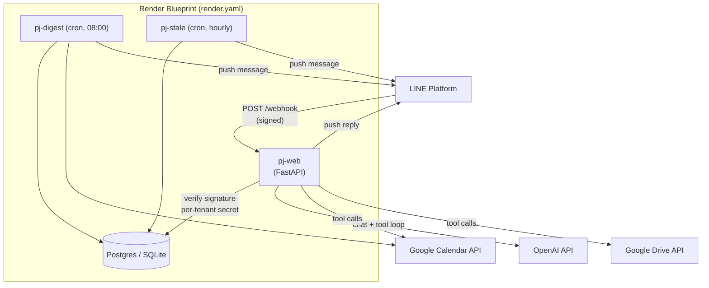
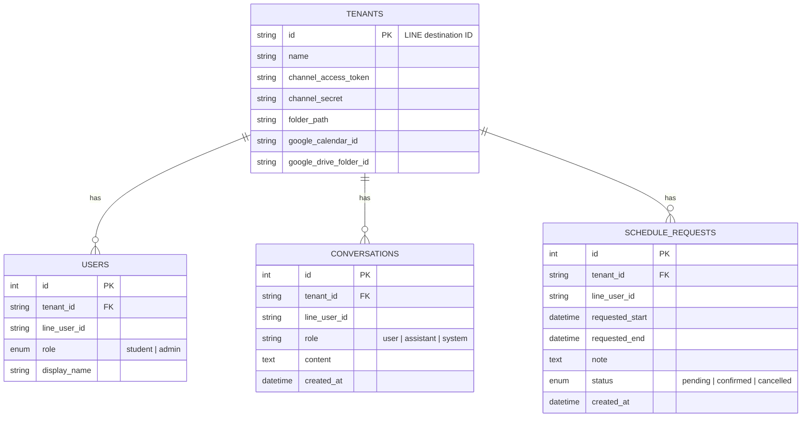

# pj — Multi-Tenant SAT Math Assistant for LINE

A production-ready, multi-tenant LINE Messaging API backend that runs
**pj**, an AI SAT Math tutor assistant with role-aware tool calling
(Google Calendar + Drive) and 24/7 background scheduling.


One backend serves any number of independent LINE Official Accounts
("tenants") — each with its own tutor, calendar, Drive folder, and set of
students — with isolated chat history, role-based permissions (student vs
admin), and no cross-tenant data leakage.

## Table of contents

- [Overview](#overview)
- [Architecture](#architecture)
- [Tech stack](#tech-stack)
- [Quick start](#quick-start)
- [Configuration](#configuration)
- [Database schema](#database-schema)
- [Tools & role-based permissions](#tools--role-based-permissions)
- [Background jobs](#background-jobs)
- [Deployment](#deployment)
- [Testing](#testing)
- [Troubleshooting](#troubleshooting)
- [Project structure](#project-structure)
- [Known limitations / roadmap](#known-limitations--roadmap)

## Overview

A student or tutor messages pj on LINE like any other contact. Behind that
one chat interface:

- **Multi-tenant by design** — the LINE `destination` ID in every webhook
  payload routes the request to the right tenant's own LINE credentials,
  Google Calendar, Drive folder, and conversation history. Tenants never
  see each other's data.
- **Role-aware** — every user is a `student` or `admin`. pj gets a
  different system prompt and a different, enforced set of tools per
  role (e.g. only admins can actually book a calendar slot).
- **Tool-calling, not just chat** — pj can check real calendar
  availability, search a real Drive folder, log/confirm session requests,
  and (as an admin) book/cancel events or upload materials — via OpenAI
  function calling dispatched to the Google APIs server-side.
- **Runs unattended** — a daily admin digest and an hourly stale-request
  reminder run as scheduled jobs, independent of anyone messaging the bot.
- **Deployable in one apply** — a `render.yaml` Blueprint provisions
  Postgres, the web service, and both cron jobs on Render; the same
  Docker image works on any other container host.

## Architecture



**Request flow:** LINE signs every webhook POST with a per-channel secret.
Because this service is multi-tenant, the tenant (and therefore which
secret to verify against) is only known once the JSON body is parsed — so
`destination` is read *before* signature verification, the matching
tenant row is looked up, and only then is the signature checked against
that tenant's own `channel_secret`. See `app/main.py`.

## Tech stack

| Layer | Choice |
|---|---|
| Web framework | FastAPI (async) on Gunicorn + Uvicorn workers |
| LINE SDK | `line-bot-sdk` v3 (async `MessagingApi`, `WebhookParser`) |
| ORM / DB | SQLModel (SQLAlchemy 2.0 async) — SQLite locally, Postgres in production |
| LLM | OpenAI (`AsyncOpenAI`, function/tool calling, multi-turn loop) |
| External tools | `google-api-python-client` (Calendar + Drive), service-account auth |
| Scheduling | APScheduler (always-on) or platform-native cron (`run_job.py`) |
| Hosting | Docker image; `render.yaml` Blueprint for Render, `Procfile` for Railway/Heroku-style |

## Quick start

```bash
git clone <this-repo> && cd Satmath67
python3 -m venv .venv && source .venv/bin/activate
pip install -r requirements.txt

cp .env.example .env        # fill in OPENAI_API_KEY at minimum
python seed.py init-db

# register your first tenant (see "Configuration" for where each value comes from)
python seed.py add-tenant \
  --id <line-destination-id> --name "My Tutoring Group" \
  --channel-secret <...> --channel-access-token <...>

uvicorn app.main:app --reload --port 8000
```

In another terminal, tunnel it and point LINE at it:

```bash
ngrok http 8000
# LINE Developers Console -> your channel -> Messaging API -> Webhook settings
#   Webhook URL: https://<ngrok-id>.ngrok-free.app/webhook -> Verify -> Use webhook: ON
```

Message the bot. You should get a reply, and see structured logs like:

```
INFO:pj.webhook:Received message: tenant=U... user=U... role=student text='...'
```

Google Calendar/Drive tool calls need one more piece of setup — see
[Configuration](#configuration).

## Configuration

All configuration is environment variables (`app/config.py`), loaded from
`.env` locally. `.env.example` has every key with inline comments.

| Variable | Required | Purpose |
|---|---|---|
| `DATABASE_URL` | no (defaults to local SQLite) | `sqlite+aiosqlite:///./pj.db` locally; a Postgres URL in production. `postgres://`/`postgresql://` URLs from Render/Supabase/Neon are auto-rewritten to `postgresql+asyncpg://` — paste them in as-is. |
| `OPENAI_API_KEY` | **yes** | pj's LLM. From [platform.openai.com](https://platform.openai.com/api-keys). |
| `OPENAI_MODEL` | no (default `gpt-4o-mini`) | Any tool-calling-capable chat model. |
| `GOOGLE_SERVICE_ACCOUNT_FILE` **or** `GOOGLE_SERVICE_ACCOUNT_JSON` | only if using Calendar/Drive tools | Set exactly one. File path locally; full key JSON as a single-line string in production (no persistent disk to put a file on). See below. |
| `LINE_CHANNEL_SECRET` / `LINE_CHANNEL_ACCESS_TOKEN` | no | Convenience defaults for `seed.py add-tenant --from-env` only. Runtime webhook handling always reads per-tenant values from the `tenants` table — never these. |
| `DIGEST_TIMEZONE` | no (default `UTC`) | IANA tz (e.g. `Asia/Bangkok`) the daily digest's "today" is computed in. |
| `STALE_REQUEST_HOURS` | no (default `24`) | How long a session request can sit unconfirmed before the reminder job flags it. |
| `ENABLE_SCHEDULER` | no (default `false`) | Runs the in-process APScheduler inside the web process. Only safe on a single, unscaled instance — see [Background jobs](#background-jobs). |

<details>
<summary><strong>Setting up the Google service account</strong> (needed for Calendar/Drive tools)</summary>

pj authenticates to Google as one shared **service account** — not
per-user OAuth, since it acts on the tutor's own calendar and shared
materials folder.

1. In [Google Cloud Console](https://console.cloud.google.com/), enable
   the **Google Calendar API** and **Google Drive API** for a project.
2. Create a service account (IAM & Admin → Service Accounts) and
   download a JSON key.
3. Locally: save it (e.g. `secrets/google-service-account.json`, already
   `.gitignore`d) and set `GOOGLE_SERVICE_ACCOUNT_FILE` to that path. In
   production: paste the whole key JSON into `GOOGLE_SERVICE_ACCOUNT_JSON`.
4. Copy the service account's `client_email`
   (`pj-bot@your-project.iam.gserviceaccount.com`-shaped).
5. **Per tenant**, share that tutor's Google Calendar and Drive materials
   folder with that email:
   - Calendar → Settings → that calendar → "Share with specific people" →
     add the email with **"Make changes to events"**.
   - Drive folder → Share → add the email as **Editor**.
6. Get the two IDs for `seed.py add-tenant`: the Calendar ID is usually
   the tutor's Gmail address (or Settings → "Integrate calendar" →
   Calendar ID); the Drive folder ID is the segment after `/folders/` in
   the folder's URL.

</details>

## Database schema



- **conversations** is scoped to `(tenant_id, line_user_id)`, giving every
  student their own isolated thread even within the same tenant — the LLM
  only ever sees that pair's last 10 messages.
- **schedule_requests** exists because students can't book the calendar
  directly: `request_session_time` logs a pending row here; an admin
  resolves it via `resolve_schedule_request`. It's also what the
  stale-reminder job scans.

No Alembic migration chain yet — `init_db()` (run on every process start)
creates missing tables via `SQLModel.metadata.create_all` and separately
`ALTER TABLE`s in the `google_calendar_id`/`google_drive_folder_id`
columns on a pre-existing `tenants` table. Safe to run repeatedly, on
SQLite or Postgres. Worth replacing with real migrations before the
schema churns much more.

## Tools & role-based permissions

pj's LLM loop (`app/llm.py`) is offered a different tool set per role;
`app/tool_registry.py` enforces that twice — once by only *listing*
permitted tools to the model, and again by rejecting execution
server-side if a disallowed tool is ever requested. `calendar_id`/
`folder_id` are always injected from the tenant's own row, never accepted
as model-supplied arguments, so a tenant's tools can't be pointed at
another tenant's calendar or Drive.

| Tool | Student | Admin | Backing |
|---|:---:|:---:|---|
| `check_teacher_availability` | ✅ read-only | ✅ | Calendar `freebusy.query` |
| `search_student_materials` | ✅ read-only | ✅ | Drive `files.list` |
| `request_session_time` | ✅ | — | DB insert, `status=pending` |
| `update_calendar_slot` (book/cancel) | ❌ | ✅ | Calendar `events.insert` / `.delete` |
| `upload_material` | ❌ | ✅ | Drive `files.create` |
| `get_student_summary` | ❌ | ✅ | DB roster query |
| `list_pending_requests` | ❌ | ✅ | DB query |
| `resolve_schedule_request` | ❌ | ✅ | DB update → `confirmed`/`cancelled` |

## Background jobs

Two jobs (`app/scheduler.py`), each runnable two ways:

- **`send_daily_digest`** — 08:00 (`DIGEST_TIMEZONE`): for each tenant
  with a `google_calendar_id`, lists that day's events and LINE-pushes a
  summary to every `admin` on that tenant.
- **`check_stale_requests`** — hourly: pushes admins a nudge listing
  `schedule_requests` still `pending` past `STALE_REQUEST_HOURS`.

| Mode | Entry point | When to use |
|---|---|---|
| One-shot | `python run_job.py daily-digest`  \| `stale-reminder` | Driven by a platform-native scheduler (Render Cron Jobs, GitHub Actions, an external cron webhook). No always-on process; scaling the web service can't cause duplicate firing. **Used by `render.yaml`.** |
| Always-on | `python worker.py` | Platforms without native cron (Railway, Fly.io, a VPS). Runs APScheduler in a loop. **Run exactly one instance** — two copies double-sends every push. |

`ENABLE_SCHEDULER=true` embeds the always-on mode directly in the web
process instead of a separate `worker.py` — only safe on a single,
unscaled web instance.

## Deployment

<details open>
<summary><strong>Render (recommended — one Blueprint apply)</strong></summary>

`render.yaml` provisions a managed Postgres database, the `pj-web`
service (Docker, `healthCheckPath: /health`), and two native Cron Jobs
(`pj-digest`, `pj-stale`) that run `run_job.py` on schedule.

1. **Connect the repo.** Push to your own GitHub/GitLab remote, then in
   the Render dashboard: **New → Blueprint**, select the repo. Render
   parses `render.yaml` and previews the resources above. Click **Apply**.
2. **Fill in secrets.** `render.yaml` marks these `sync: false` (Render
   creates the slot, you fill the value in via the dashboard, never
   committed to the repo):

   | Variable | Set on |
   |---|---|
   | `OPENAI_API_KEY` | `pj-web` |
   | `GOOGLE_SERVICE_ACCOUNT_JSON` | `pj-web`, `pj-digest`, `pj-stale` |
   | `LINE_CHANNEL_SECRET` / `LINE_CHANNEL_ACCESS_TOKEN` | optional, only if running `seed.py --from-env` against prod from your machine |

   `DATABASE_URL` is wired automatically (`fromDatabase: pj-postgres`).
   The cron schedules in `render.yaml` (`0 8 * * *`, `0 * * * *`) are UTC
   — convert your desired local trigger time to UTC when editing them.
3. **Seed a tenant against production:**
   ```bash
   DATABASE_URL="<render external connection string>" python seed.py add-tenant \
     --id <line-destination-id> --name "My Tutoring Group" \
     --channel-secret <...> --channel-access-token <...> \
     --google-calendar-id teacher@gmail.com --google-drive-folder-id <...>

   DATABASE_URL="<same>" python seed.py set-admin \
     --tenant-id <line-destination-id> --line-user-id <...>
   ```
4. **Point LINE at it.** LINE Developers Console → channel → Messaging
   API → Webhook settings → URL: `https://<your-app>.onrender.com/webhook`
   → Verify → Use webhook: ON. Repeat steps 3–4 per additional tenant
   (same URL for every tenant; `destination` routes internally).
5. **Monitor it.** Point [UptimeRobot](https://uptimerobot.com) or
   [Better Stack](https://betterstack.com/uptime) at
   `GET /health` (fails 503 on DB outage, not just process death).

**Checklist:**

- [ ] `pj-postgres`, `pj-web`, `pj-digest`, `pj-stale` all deployed/succeeded
- [ ] `OPENAI_API_KEY` set on `pj-web`
- [ ] `GOOGLE_SERVICE_ACCOUNT_JSON` set on all three services that need it
- [ ] Service account shared onto each tenant's calendar + Drive folder
- [ ] `GET https://<app>.onrender.com/health` → `200 {"status":"ok"}`
- [ ] Tenant seeded against production `DATABASE_URL`
- [ ] LINE webhook URL updated, **Verify** succeeds
- [ ] Real LINE message round-trips to a reply
- [ ] `pj-digest` / `pj-stale` show successful runs in Render's Logs tab
- [ ] Uptime monitor live on `/health`
- [ ] `ENABLE_SCHEDULER=false` on `pj-web` (Cron Jobs own scheduling — don't double up)

</details>

<details>
<summary><strong>Railway / any other Docker host</strong></summary>

The same `Dockerfile` runs anywhere. Without native cron:

1. Deploy the image as the `web` service (`Procfile`'s `web:` line, or
   the Dockerfile's default `CMD`).
2. Deploy a **second** service from the same image, start command
   `python worker.py` (`Procfile`'s `worker:` line) — run exactly one
   instance.
3. Point `DATABASE_URL` at that platform's Postgres add-on on both
   services.
4. Same LINE webhook / Google service-account steps as above, using that
   platform's public URL.

</details>

## Testing

There's no CI pipeline yet, but every code path below has been exercised
locally against automated tests before being committed — this section is
here so it's clear what "tested" means in this repo:

- **Unit/integration level** (real, run against actual code): webhook
  signature verification (valid, missing, wrong-tenant-secret), tenant
  resolution and the unknown-tenant 200-drop path, role scoping in
  `tool_registry` (including a blocked tool call being rejected
  server-side), the full multi-turn LLM tool-calling loop, the
  free/busy-to-open-slots calendar math, the schedule-request workflow
  (request → list → resolve), both background jobs, the SQLite→Postgres
  URL normalization, the DB migration path against a pre-Phase-3 schema,
  and the production `gunicorn` entrypoint actually serving `/health`.
- **What's mocked in those tests, and why:** the real LINE, OpenAI, and
  Google APIs are replaced with stand-ins returning canned responses —
  there's no way to exercise this repo's logic against your real
  accounts without your real credentials. This proves the *code* is
  correct; it does **not** substitute for one real end-to-end message
  after deployment with real keys.
- **Not yet automated:** there's no `pytest` suite checked into the repo
  — the tests above were run ad hoc during development. Worth formalizing
  into `tests/` with `pytest` + `pytest-asyncio` next.

## Troubleshooting

| Symptom | Likely cause | Fix |
|---|---|---|
| LINE console "Verify" fails | Webhook URL unreachable, or wrong path | Confirm the URL ends in `/webhook` and the server/tunnel is actually running; check `ngrok`'s inspector or the platform's request logs |
| `/webhook` returns 400 "Invalid signature" | Tenant's `channel_secret` in the DB doesn't match the channel's real secret | Re-run `seed.py add-tenant` with the correct `--channel-secret` |
| Message received but no reply, logs show "unknown tenant" | No `tenants` row for that `destination` | `seed.py add-tenant --id <destination> ...` — the ID must be the exact `destination` LINE sends, not the channel ID shown in the console |
| pj replies with a generic "having trouble" fallback | OpenAI call failed (bad/missing `OPENAI_API_KEY`, no credits, model name typo'd) | Check server logs for the underlying exception; verify the key works with a direct `curl` to OpenAI |
| A tool call returns `"error": "no google_calendar_id configured"` | Tenant row is missing that field | `seed.py add-tenant --google-calendar-id ... --google-drive-folder-id ...` |
| Calendar/Drive tool calls fail with a permissions error | Service account's email wasn't shared on that specific calendar/folder | Re-check step 5 of the Google service account setup, per tenant |
| `/health` returns 503 | DB unreachable | Check `DATABASE_URL`, and that the Postgres instance is up |
| Admins get every digest/reminder message twice | Both `ENABLE_SCHEDULER=true` *and* `worker.py`/Cron Jobs are running, or `worker.py` is running as more than one instance | Pick exactly one scheduling mode (see [Background jobs](#background-jobs)) and run it in exactly one place |
| `ImportError`/`ModuleNotFoundError` on startup | Dependencies not installed in the active environment | `pip install -r requirements.txt` inside the activated venv |

## Project structure

```
.
├── app/
│   ├── config.py         # env vars: DATABASE_URL, OPENAI_*, GOOGLE_*, scheduler settings
│   ├── db.py              # async SQLAlchemy engine/session, init_db() + light migration
│   ├── models.py          # Tenant, User, Conversation, ScheduleRequest (SQLModel)
│   ├── crud.py             # tenant lookup, get_or_create_user, message history, roster
│   ├── tool_registry.py    # role -> tool schemas, and the tool dispatcher
│   ├── llm.py               # OpenAI call + role-based system prompts + tool-call loop
│   ├── scheduler.py         # Phase 4 job bodies + APScheduler wiring
│   └── main.py               # FastAPI app: /webhook, /health
├── tools/
│   ├── google_auth.py    # shared Google service-account credentials/clients
│   ├── calendar.py        # check_teacher_availability, update_calendar_slot, list_events_for_date
│   └── drive.py            # search_student_materials, upload_material
├── seed.py                  # CLI: init-db / add-tenant / set-admin / list
├── run_job.py                 # one-shot job runner (Render Cron Jobs / external cron)
├── worker.py                    # always-on job runner (platforms without native cron)
├── Dockerfile
├── render.yaml                    # Render Blueprint: web service + Postgres + 2 Cron Jobs
├── Procfile                        # Railway/Heroku-style process types
└── .env.example
```

## Known limitations / roadmap

- `search_student_materials` / `upload_material` match by filename and
  plain-text content only — no OCR or PDF content indexing.
- Calendar availability assumes a fixed 9am–6pm UTC business-hours window
  (`tools/calendar.py`); not yet per-tenant or timezone-aware.
- No Alembic migration chain — fine at current schema size, worth
  adopting before it churns further.
- No automated `pytest` suite in-repo yet (see [Testing](#testing)).
- Single shared OpenAI/Google credentials across all tenants — per-tenant
  API keys/quotas would be a natural next step for a larger deployment.
